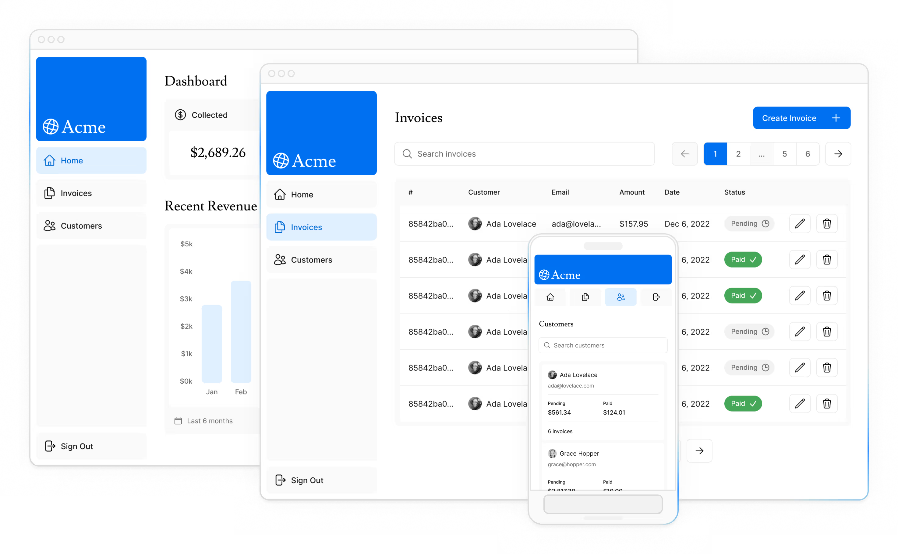

# Learn Next.js
Tutorials - NextJs Dashboard  - [Next.js](https://nextjs.org/learn/basics/create-nextjs-app)
Welcome to the Next.js App Router course! In this free interactive course, you'll learn the main features of Next.js by building a full-stack web application



## Introduction

### Overview
Here's an overview of features you'll learn about in this course:

- `Styling`: The different ways to style your application in Next.js.
- `Optimizations`: How to optimize images, links, and fonts.
- `Routing`: How to create nested layouts and pages using file-system routing.
- `Data Fetching`: How to set up a database on Vercel, and best practices for fetching and streaming.
- `Search and Pagination`: How to implement search and pagination using URL Search Params.
- `Mutating Data`: How to mutate data using React Server Actions, and revalidate the Next.js cache.
- `Error Handling`: How to handle general and 404 not found errors.
- `Form Validation and Accessibility`: How to do server-side form validation and tips for improving accessibility.
- `Authentication`: How to add authentication to your application using NextAuth.js and Middleware.
- `Metadata`: How to add metadata and prepare your application for social sharing.


## Chapter 1. Getting Started

```bash
npx create-next-app@latest nextjs-dashboard --example "https://github.com/vercel/next-learn/tree/main/dashboard/starter-example" --use-pnpm

cd nextjs-dashboard
npm run dev
```


### Running the development server
Run npm i to install the project's packages. Then, run npm run dev to start the development server. Open http://localhost:3000 with your browser to see the result.
```bash
npm i
npm run dev
```


## Chapter 2 - CSS Styling
Currently, your home page doesn't have any styles. Let's look at the different ways you can style your Next.js application.
In this chapter...

- Here are the topics we’ll cover
- How to add a global CSS file to your application.
- Two different ways of styling: Tailwind and CSS modules.
- How to conditionally add class names with the clsx utility package.


## Chapter 3 - Optimizing Fonts and Images

In this chapter...
Here are the topics we’ll cover: 
- How to add custom fonts with next/font.
- How to add images with next/image.
- How fonts and images are optimized in Next.js.

## Chapter 4 - Creating Layouts and Pages

So far, your application only has a home page. Let's learn how you can create more routes with layouts and pages.

In this chapter... Here are the topics we’ll cover
- Create the dashboard routes using file-system routing.
- Understand the role of folders and files when creating new route segments.
- Create a nested layout that can be shared between multiple dashboard pages.
- Understand what colocation, partial rendering, and the root layout are.


## Chapter 4 - Creating Layouts and Pages
So far, your application only has a home page. Let's learn how you can create more routes with layouts and pages.

In this chapter... Here are the topics we’ll cover
- Create the dashboard routes using file-system routing.
- Understand the role of folders and files when creating new route segments.
- Create a nested layout that can be shared between multiple dashboard pages.
- Understand what colocation, partial rendering, and the root layout are.


## Chapter 6 - Setting Up Your Database

Before you can continue working on your dashboard, you'll need some data. In this chapter, you'll be setting up a PostgreSQL database using @vercel/postgres. If you're already familiar with PostgreSQL and would prefer to use your own provider, you can skip this chapter and set it up on your own. Otherwise, let's continue!

In this chapter... Here are the topics we’ll cover

- Push your project to GitHub.
- Set up a Vercel account and link your GitHub repo for instant previews and deployments.
- Create and link your project to a Postgres database.
- Seed the database with initial data.


```bash
#Finally, run npm i @vercel/postgres in your terminal to install the Vercel Postgres SDK.
npm i @vercel/postgres

```

### Seed your database

```bash
# add a new script to your package.json file that will seed your database with initial data.
 "seed": "node -r dotenv/config ./scripts/seed.js"

 # Run the seed script
npm run seed
```


## Chapter 7 - Fetching Data

Now that you've created and seeded your database, let's discuss the different ways you can fetch data for your application, and build out your dashboard overview page.

In this chapter... Here are the topics we’ll cover
- Learn about some approaches to fetching data: APIs, ORMs, SQL, etc.
- How Server Components can help you access back-end resources more securely.
- What network waterfalls are.
- How to implement parallel data fetching using a JavaScript Pattern.


## Chapter 8 - Static and Dynamic Rendering

In the previous chapter, you fetched data for the Dashboard Overview page. However, we briefly discussed two limitations of the current setup:

The data requests are creating an unintentional waterfall.
The dashboard is static, so any data updates will not be reflected on your application.


In this chapter... Here are the topics we’ll cover
- What static rendering is and how it can improve your application's performance.
- What dynamic rendering is and when to use it.
- Different approaches to make your dashboard dynamic.
- Simulate a slow data fetch to see what happens.


## Chapter 11 - Adding Search and Pagination

```sh
npm i use-debounce
```

##  Chapter 12 - Mutating Data
In the previous chapter, you implemented search and pagination using URL Search Params and Next.js APIs. Let's continue working on the Invoices page by adding the ability to create, update, and delete invoices!

In this chapter...
- Here are the topics we’ll cover
- What React Server Actions are and how to use them to mutate data.
- How to work with forms and Server Components.
- Best practices for working with the native formData object, including type validation.
- How to revalidate the client cache using the revalidatePath API.
- How to create dynamic route segments with specific IDs.


## Chapter 13 - Handling Errors

In this chapter...
Here are the topics we’ll cover
- How to use the special `error.tsx` file to catch errors in your route segments, and show a fallback UI to the user.
- How to use the notFound function and not-found file to handle 404 errors (for resources that don’t exist).


## Chapter 14 - Improving Accessibility
In this chapter...Here are the topics we’ll cover

- How to use `eslint-plugin-jsx-a11y` with Next.js to implement accessibility best practices.
- How to implement server-side form validation.
- How to use the React useFormState hook to handle form errors, and display them to the user

## Chapter 15 - Adding Authentication

In this chapter...Here are the topics we’ll cover
- What is authentication.
- How to add authentication to your app using NextAuth.js.
- How to use Middleware to redirect users and protect your routes.
- How to use React's useFormStatus and useFormState to handle pending states and form errors.

```sh
npm install next-auth@beta

# generate a secret key for your application
openssl rand -base64 32
# key : NEKCSPEiXPczefdFWyv3WnoArb6LKOpA0TUiO6bBC30=
AUTH_SECRET=your-secret-key
```